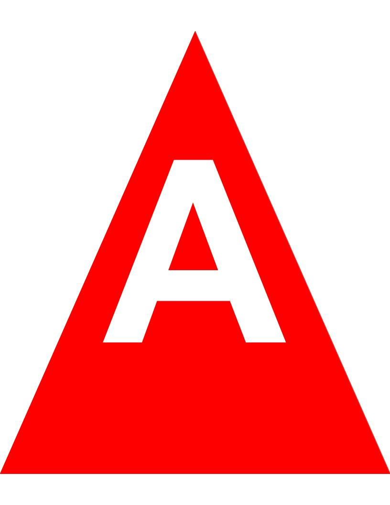
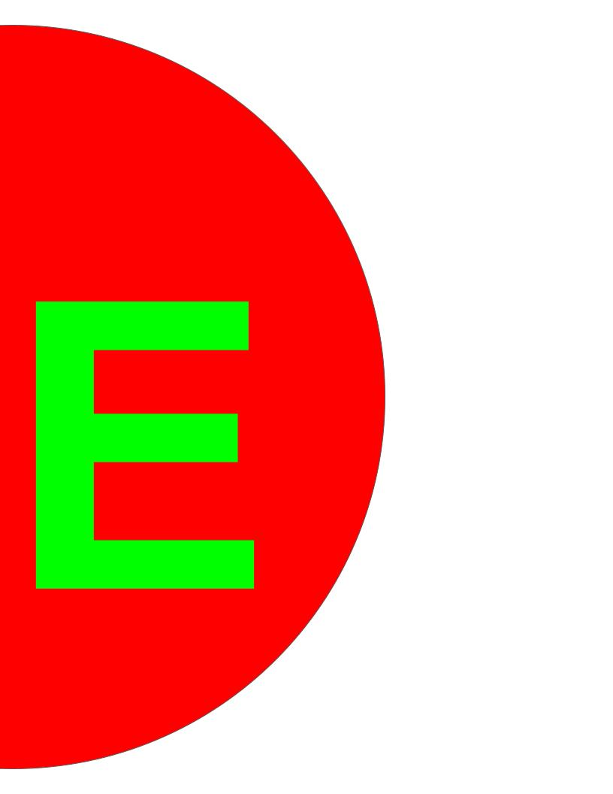
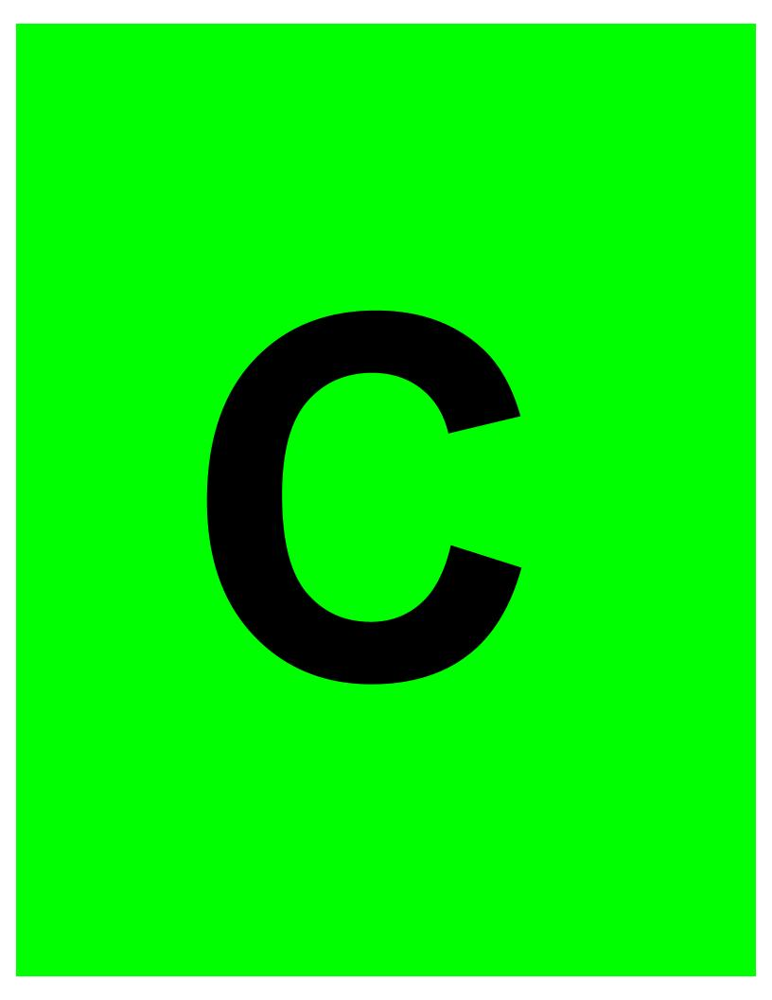
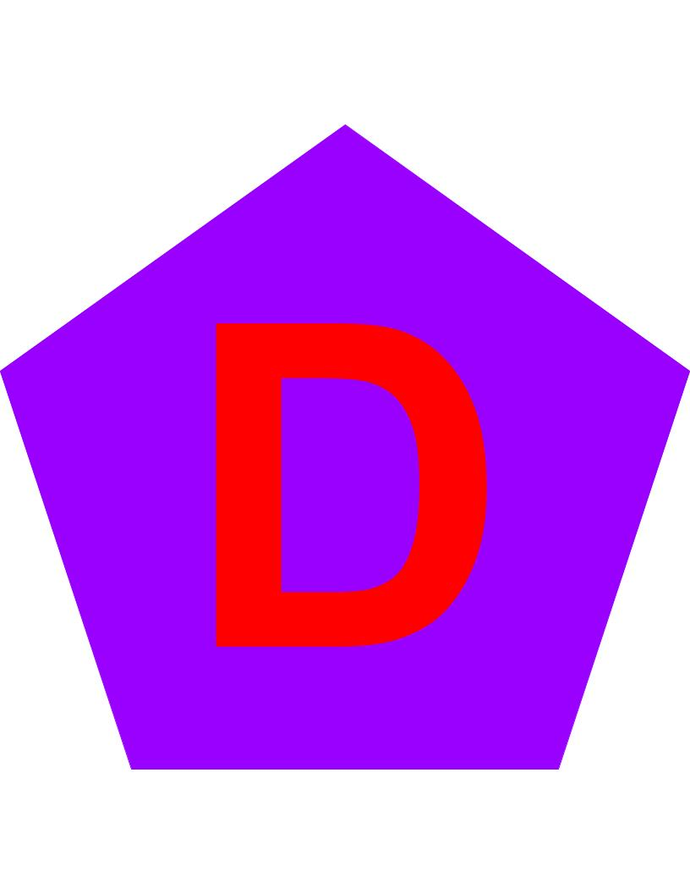
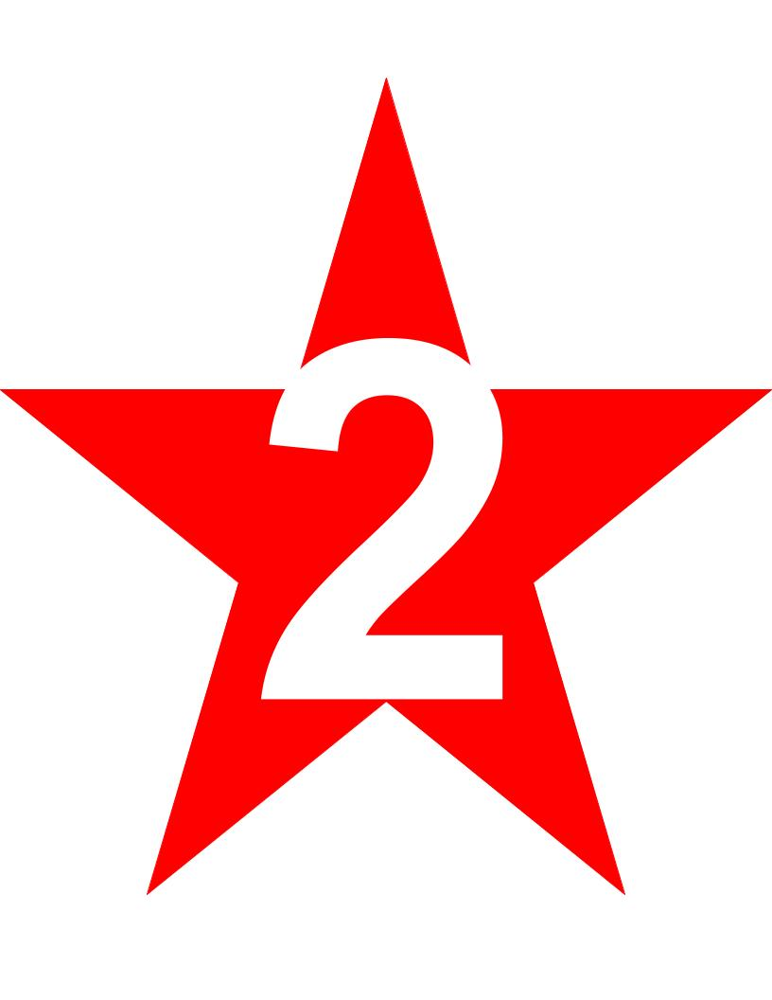
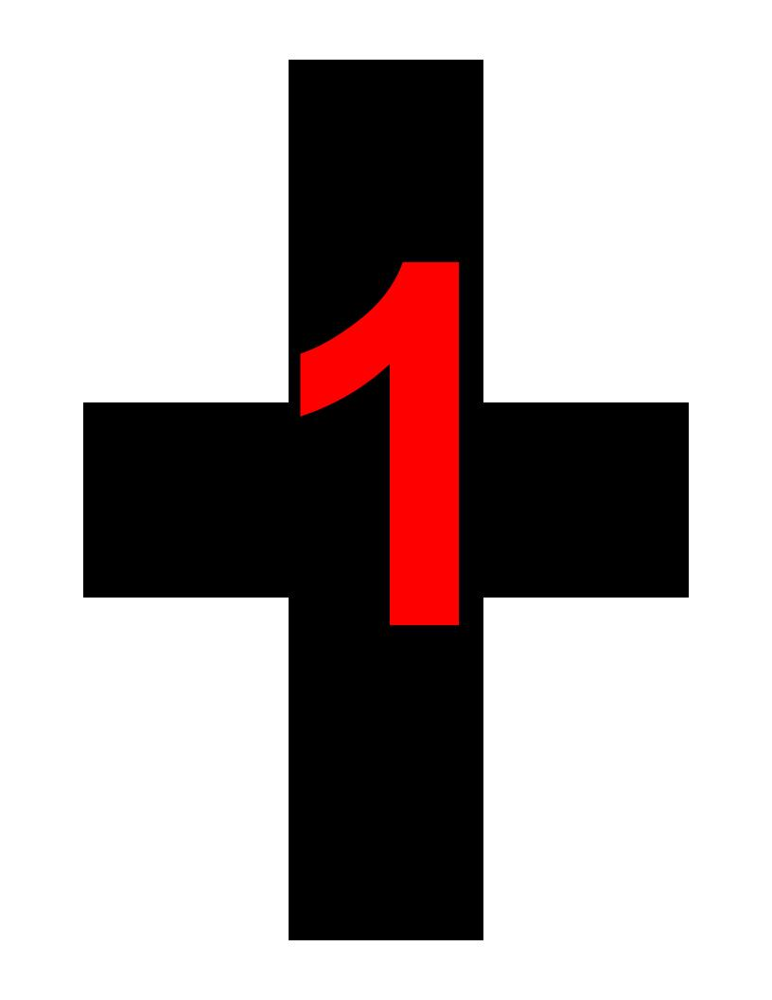
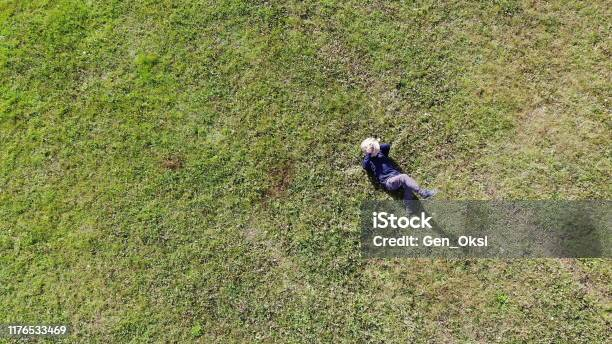
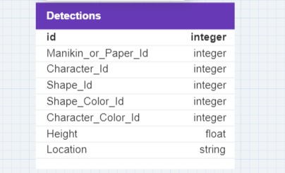

# SUAS 2024 Object Detection Task

## Introduction

This is a GitHub repository aimed to give information about the Object Detection systems designed for the [SUAS (Student Unmanned Aerial Systems) 2024](https://suas-competition.org/) Competition. 

## Object Types

The **Object Detection Task** consists of detecting a set of standard objects and an emergent object.

The **standard objects** are geometric shapes, namely:

1. Triangle [(view)](images/triangle.jpg)
2. Circle [(view)](images/circuit.jpg)
3. Semi-circle [(view)](images/semi-circuit.jpg)
4. Quarter-circle [(view)](images/quarter-circle-edited.jpg)
5. Rectangle [(view)](images/rectangle.jpg)
6. Pentagon [(view)](images/pentagon.jpg)
7. Star ([view)](images/star.jpg)
8. Cross [(view)](images/cross.jpg)

The standard objects can be of **colours**:

1. White
2. Black
3. Red
4. Blue
5. Green
6. Purple
7. Brown
8. Orange

The **emergent object** is a manikind dressed in clothes lying on the ground [view](images/manikind.jpg).

| Object Types | Images | Color | Description |
| ---------|----------|----------|----------|
| Triangle |  | white-orange | contains (A-Z) or (0-9) |
| Circle |   | white-orange | contains (A-Z) or (0-9) |
| Semi-circle |   | white-orange | contains (A-Z) or (0-9) |
| Quarter-circle |   | white-orange | contains (A-Z) or (0-9) |
| Rectangle |  | white-orange | contains (A-Z) or (0-9) |
| Pentagon |   | white-orange | contains (A-Z) or (0-9) |
| Star |   | white-orange | contains (A-Z) or (0-9) |
| Cross |   | white-orange | contains (A-Z) or (0-9) |
| Manikin |  | **unkown** | dressed |

## Target Goal

To make a control flight, during which:
- Detect all the objects on the ground
- If one object detected:
  - Get geolocation
  - Save frame of the object
  - If manikin: save to database
  - If A4:
    - Classify shape
    - Classify character
    - Classify chape color
    - Crop character and classify character color
    - Save to database

## Timeline

1. A4 or Manikin Detection Model:
   - [ ] Cleaning of 25k dataset (1 week)
   - [ ] Collection of images (drone will be ready in ~1 week)
   - [ ] 40k per class
   - [ ] Labelling (SAM, by hand, and own model)
   - [ ] Training model
   - [ ] Checking on validation dataset
   - [ ] Ready model (end of January)

## Detailed Standard Objects Detection
**Final Decision:**

**A YOLOv8 model for manikin and A4 paper detection:**
- [ ] Cleaning of 25k dataset
- [ ] Manual collection of images (using drone or photographing from high point)
- [ ] Labelling of human using SAM
- [ ] Manual labelling of A4 paper
- [ ] Automatic labelling using pre-trained model
- [ ] Comparing model success using validation dataset

Number of images:
- ~40k per class

**Input:** image of lying objects\
**Output:** manikin or A4

**A YOLOv8 model for character recognition (36 classes):**
- [ ] Manual collection of images (using drone or photographing from high point)
- [ ] Manual labelling
- [ ] Automatic labelling using pre-trained models
- [ ] Comparing model success using validation dataset

Number of images:
- ~1k per class

**Input:** cropped image A4\
**Output:** character

**A YOLOv8 model for shape recognition (8 classes):**
- [ ] Manual collection of images (using drone or photographing from high point)
- [ ] Manual labelling
- [ ] Automatic labelling using pre-trained models
- [ ] Comparing model success using validation dataset

Number of images:
- ~5k per class

**Input:** cropped image A4\
**Output:** shape

**A YOLOv8 model for color recognition (8 classes):**
- [ ] Manual collection of images (using drone or photographing from high point)
- [ ] Manual labelling
- [ ] Automatic labelling using pre-trained models
- [ ] Comparing model success using validation dataset

Number of images:
- ~5k per class

**Input:** cropped image A4\
**Output:**
- Color of Shape
- Color of Character

**Important details when collecting images:**
- Shade
- Light
- Rotation
- Degree of camera

**Procedure:**
- Make 5 detections for object on the ground
- Make 5 recognitions for shape
- Make 5 recognitions for character
- Make 5 recognitions for character color
- Make 5 recognitions for shape color
- Save results in SQLite

**Target goal:**
- Choose the most frequent result
- The result's frequency - the 2nd frequent result's frequency > 20%

**Localization (identifying geolocation):**
- Save location points into the database (SQLLite) when detecting
- Height: using Lidar
- Location: using GPS

When attaching a bottle for manikin drop if:
```
object.id == manikin.id
```

When attaching a bottle for shape drop if:
```
object.id == A4.id and shape.id == given_shape.id and character.id == given_character.id and shape_color.id == given_shape_color.id and character_color.id == given_character_color.id
```

**SQLite database**:\


```
SELECT column_name(s)
FROM table_name
ORDER BY column_name
OFFSET (n-1)*5 rows
FETCH 5 next rows
```
