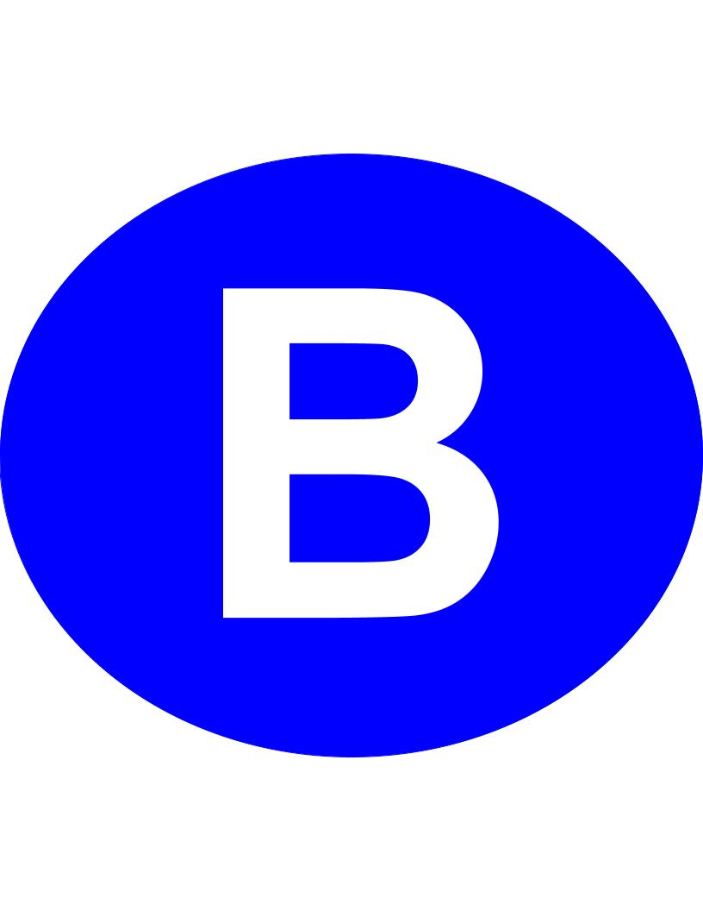
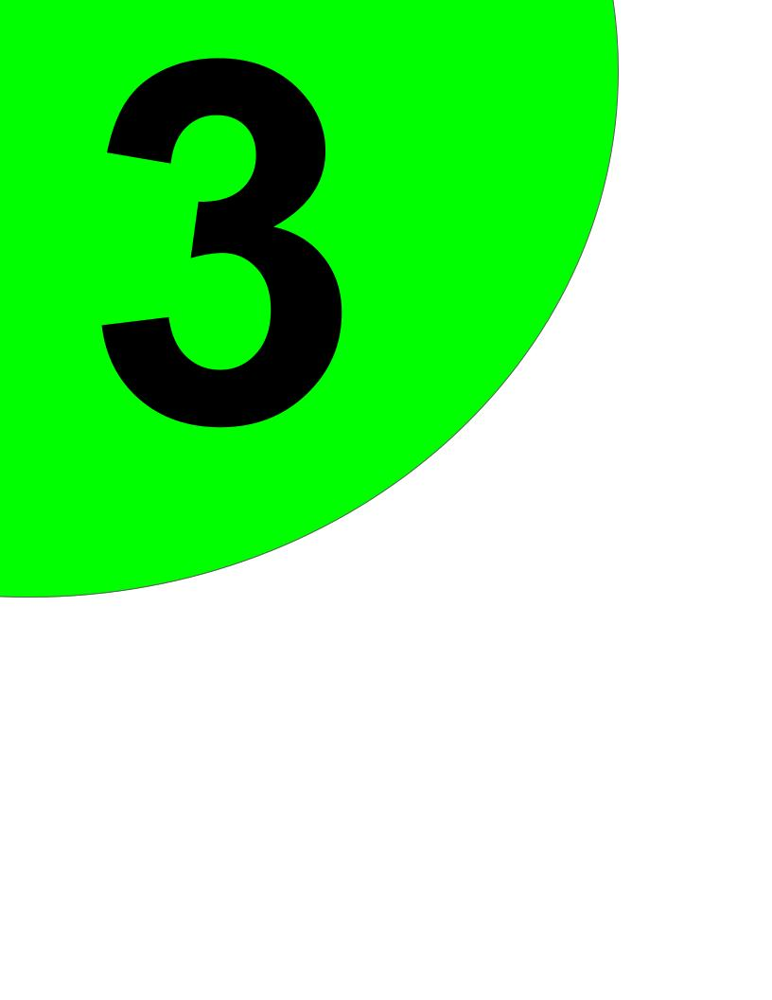

# SUAS 2024 Object Detection Task

## Introduction

This is a GitHub repository aimed to give information about the Object Detection systems designed for the [SUAS (Student Unmanned Aerial Systems) 2024](https://suas-competition.org/) Competition. 

## Object Types

The **Object Detection Task** consists of detecting a set of standard objects and an emergent object.

The **standard objects** are geometric shapes, namely:

1. Triangle [(view)](images/triangle.jpg)
2. Circle [(view)](images/circuit.jpg)
3. Semi-circle [(view)](images/semi-circuit.jpg)
4. Quarter-circle [(view)](images/quarter-circle-edited.jpg)
5. Rectangle [(view)](images/rectangle.jpg)
6. Pentagon [(view)](images/pentagon.jpg)
7. Star ([view)](images/star.jpg)
8. Cross [(view)](images/cross.jpg)

The standard objects can be of **colours**:

1. White
2. Black
3. Red
4. Blue
5. Green
6. Purple
7. Brown
8. Orange

The **emergent object** is a manikind dressed in clothes lying on the ground [view](images/manikind.jpg).

| Object Types | Images | Color | Description |
| ---------|----------|----------|----------|
| Triangle |  | white-orange | contains (A-Z) or (0-9) |
| Circle |   | white-orange | contains (A-Z) or (0-9) |
| Semi-circle |   | white-orange | contains (A-Z) or (0-9) |
| Quarter-circle |   | white-orange | contains (A-Z) or (0-9) |
| Rectangle |  | white-orange | contains (A-Z) or (0-9) |
| Pentagon |   | white-orange | contains (A-Z) or (0-9) |
| Star |   | white-orange | contains (A-Z) or (0-9) |
| Cross |   | white-orange | contains (A-Z) or (0-9) |
| Manikin |  | **unkown** | dressed |

## Target Goal
**General procedure - Object Detection-Localization-Classification (ODLC):**

- We detect an object on the ground
- Verify whether it coincides with given parameters
- If yes, drop at the location

**Manikin Recognition:**
- Gather images with drone
- Automatic labelling with SAM
- Train YOLOv8 model

**Standard Objects Detection** includes 4 sub-tasks:
- Shape Detection
- Character Detection
- Color Detection for Shape
- Color Detection for Character

## Detailed Standard Objects Detection
**Shape Detection**
- Print different shapes on A4
- Label them
- Use YOLOv8 model

**Character Detection**
- Use OCR Recognition with Python

For example, EasyOCR:

Given result:

([[264, 340], [682, 340], [682, 752], [264, 752]], **'2'**, 0.9999928474554167)

Given result:

([[240, 344], [614, 344], [614, 756], [240, 756]], **'B'**, 0.9852499557346164)

*Problem:* works only when white characters

**Color Detection**
- K-means Clustering algorithm
- Convolutional Neural Network (CNN)

*Have not tried yet colored detection*

